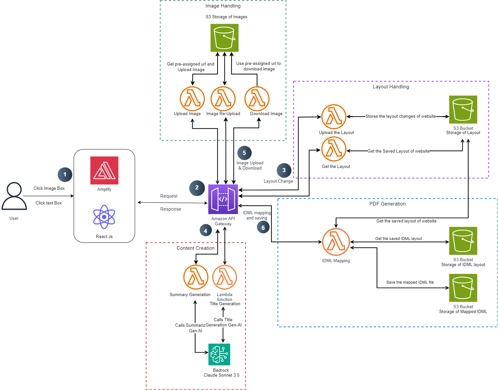

# Newswell Project Backend CDK

This project sets up a serverless infrastructure for the Newswell project using AWS CDK (Cloud Development Kit). The stack includes S3 for data storage, Lambda functions for processing and API Gateway for exposing APIs. It enables automatic deployment, secure data handling and API integrations.

## Prerequisites

Before proceeding, ensure you have the following installed:
- [AWS CLI](https://aws.amazon.com/cli/)
- [Node.js](https://nodejs.org/)
- [Python 3.7+](https://www.python.org/downloads/)
- [AWS CDK](https://docs.aws.amazon.com/cdk/latest/guide/cli.html)

### Project Structure
- S3 Bucket: Used for storing and managing data.
- Lambda Functions: Execute serverless functions to handle different tasks.
- API Gateway: Exposes endpoints for external communication.
- IAM Roles: Provides necessary permissions for Lambda functions.



## Setup Instructions

### Install CDK

To install AWS CDK, ensure you have Node.js (with NPM), AWS CLI configured, and then run

```bash
npm install -g aws-cdk
```

### Clone the Project
First, clone the repository from GitHub:

```bash
git clone https://github.com/ASUCICREPO/Newswell.git
cd backend
```

### Setup Virtual Environment

To create and activate a virtual environment (Mac/Linux):

```bash
python -m venv .venv
source .venv/bin/activate
```

#### For Windows:

```bash
python -m venv .venv
.venv\Scripts\activate.bat
```

### Install Required Dependencies

Install the Python dependencies using the following command:

```bash
pip install -r requirements.txt
```

### Update Bucket Name in cdk.json

You need to specify the S3 bucket name in the `cdk.json` file. Open the file and update the value for `bucket_name`:

```bash
{
  "app": "python3 app.py",
  "context": {
    "bucket_name": "<your-unique-bucket-name>"
    }
}
```

### Login to AWS CLI

Ensure you are logged in to your AWS account:

```bash
aws configure
```

You will need to input your AWS Access Key, Secret Key, and default region.

### Bootstrap the CDK

Before deploying the stack, you need to bootstrap your environment:

```bash
cdk bootstrap
```

### Synthesize CloudFormation Template

To generate the CloudFormation template for this project:

```bash
cdk synth
```

### Deploy the Stack

To deploy the stack to your AWS environment:

```bash
cdk deploy
```

This will deploy the S3 bucket, Lambda functions, API Gateway, and IAM roles.

### Lambda Functions

This CDK project deploys multiple Lambda functions:

- `SummaryLambda`: Handles requests for summary creation.
- `TitleLambda`: Handles requests for title generation.
- `UpdateDataLambda`: Manages data updates.
- `GetDataLambda`: Fetches data from S3.
- `GeneratePresignedUrlNewLambda`: Generates presigned URLs for new uploads.
- `GeneratePresignedUrlExistingLambda`: Generates presigned URLs for existing objects.
- `GetPresignedUrlLambda`: Retrieves presigned URLs.

### API Endpoints
Once the stack is deployed, you can access the following API endpoints:

- Summary API (POST): `/summary`
- Title API (POST): `/title`
- Update Data API (POST): `/update_data`
- Get Data API (GET): `/get_data`
- Generate Presigned URL for New Uploads (GET): `/generate_presigned_url_new`
- Generate Presigned URL for Existing Files (GET): `/generate_presigned_url_existing`
- Get Presigned URL (GET): `/get_presigned_url`

### Cleanup
To delete the resources and avoid incurring charges, run:

```bash
cdk destroy
```

### Useful CDK Commands
- `cdk ls`: List all stacks in the app.
- `cdk synth`: Emit the synthesized CloudFormation template.
- `cdk deploy`: Deploy this stack to your AWS account/region.
- `cdk diff`: Compare the deployed stack with the current state.
- `cdk docs`: Open the CDK documentation.

### Troubleshooting
If you encounter any issues during the setup or deployment process, try the following steps:

Check AWS CLI Configuration: Ensure your AWS CLI is configured correctly by running:

```bash
aws configure
```

Confirm that the region, access key, and secret key are correctly set.

Virtual Environment Issues: If you encounter issues with the virtual environment (e.g., packages not found), try recreating the environment:

```bash
deactivate  # If the virtualenv is currently active
rm -rf .venv  # Delete the existing virtual environment
python -m venv .venv  # Recreate the virtual environment
source .venv/bin/activate  # Activate on MacOS/Linux
.venv\Scripts\activate.bat  # Activate on Windows
pip install -r requirements.txt  # Reinstall dependencies
```

### Deployment Fails:

- Ensure that the bucket name in cdk.json is unique.
- Check CloudFormation in the AWS Console for any specific error messages.
- Validate that your AWS credentials have the necessary permissions to create resources.

### Common Errors:

- S3 Bucket Already Exists: Ensure your bucket name is globally unique in the `cdk.json` file.
- Ensure you have necessary IAM roles and permissions to deploy the Stack.

# Helpful Links:
- [AWS CDK Documentation](https://docs.aws.amazon.com/cdk/v2/guide/home.html)
- [AWS Lambda Documentation](https://docs.aws.amazon.com/lambda/latest/dg/welcome.html)
- [AWS S3 Documentation](https://docs.aws.amazon.com/s3/)
- [AWS API Gateway Documentation](https://docs.aws.amazon.com/apigateway/latest/developerguide/welcome.html)

